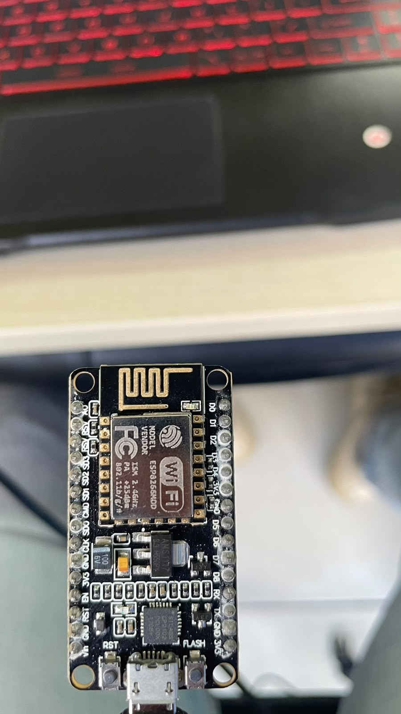
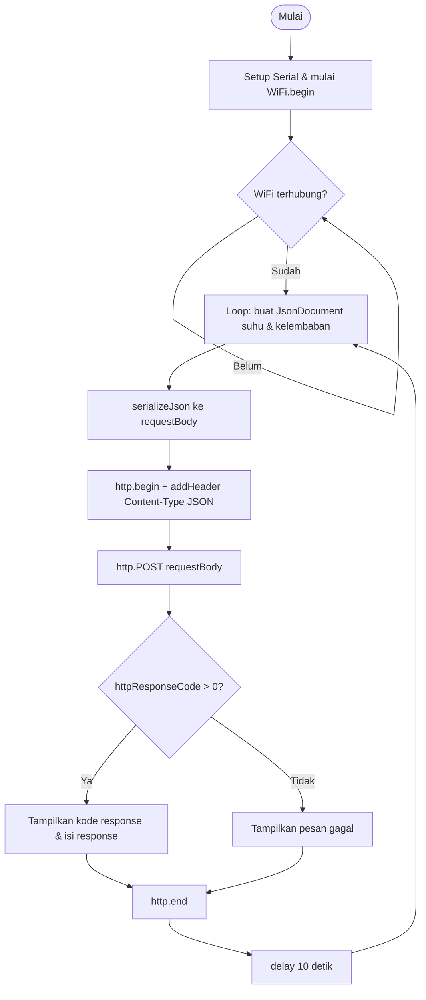

# Pertemuan 3 — Protokol Komunikasi IoT (HTTP dan MQTT dengan Format JSON)

**Nama:** Muhammad Nabil Zaedan Agesy
**NIM:** H1H024062
**Mata Kuliah:** Praktikum Sistem Internet of Things (TK245005)

## Deskripsi Singkat Percobaan

Praktikum ini bertujuan memahami dan membandingkan dua protokol komunikasi yang umum dipakai pada sistem IoT, yaitu **HTTP** (model request-response) dan **MQTT** (model publish-subscribe), dengan data yang dipertukarkan diformat menggunakan **JSON**.

Terdapat dua percobaan:

- **Percobaan 3A** — mengirim data sensor (suhu dan kelembaban) dari mikrokontroler ke endpoint `https://httpbin.org/post` menggunakan HTTP POST.
- **Percobaan 3B** — mempublikasikan data sensor yang sama ke broker MQTT publik `broker.hivemq.com` menggunakan pola publish-subscribe.

## Perangkat yang Digunakan

Modul acuan menggunakan board ESP32, namun pada praktikum ini digunakan **NodeMCU ESP8266** sebagai penyesuaian karena board yang tersedia. Konsekuensinya, pustaka yang dipakai juga disesuaikan: `ESP8266WiFi.h` dan `ESP8266HTTPClient.h` (bukan `WiFi.h`/`HTTPClient.h` bawaan ESP32), serta penambahan `WiFiClientSecure` dengan `setInsecure()` agar ESP8266 bisa melakukan request HTTPS ke `httpbin.org` tanpa perlu memvalidasi sertifikat server.



## Library / Dependencies

| Library | Fungsi |
|---|---|
| `ESP8266WiFi.h` | Menghubungkan board ke jaringan WiFi (mode Station) |
| `ESP8266HTTPClient.h` | Membuat request HTTP (GET/POST) dari ESP8266 |
| `WiFiClientSecure` | Membungkus koneksi TCP dengan TLS agar bisa mengakses endpoint HTTPS |
| `PubSubClient` (by Nick O'Leary) | Client MQTT — connect ke broker, publish, dan subscribe |
| `ArduinoJson` (by Benoit Blanchon) | Membuat dan membaca struktur data JSON (`JsonDocument`, `serializeJson`) |

Instal `PubSubClient` dan `ArduinoJson` melalui *Library Manager* pada Arduino IDE.

---

## Percobaan 3A — Komunikasi Data Menggunakan HTTP

### Penjelasan Code

- `WiFi.begin(ssid, password)` — memerintahkan ESP8266 menyambung ke jaringan WiFi sesuai SSID dan password yang diberikan. Program menunggu di dalam `while (WiFi.status() != WL_CONNECTED)` sampai status koneksi berhasil.
- `WiFiClientSecure client; client.setInsecure();` — menyiapkan client TCP dengan lapisan TLS untuk mengakses endpoint HTTPS. `setInsecure()` melewati proses validasi sertifikat, cukup untuk keperluan uji coba tapi tidak disarankan untuk aplikasi produksi.
- `http.begin(client, serverUrl)` dan `http.addHeader("Content-Type", "application/json")` — membuka koneksi ke endpoint `httpbin.org/post` dan menandai bahwa body request yang dikirim berformat JSON, supaya server bisa mem-parsing data dengan benar.
- `JsonDocument doc; doc["suhu"] = 28.5; doc["kelembaban"] = 65.0;` — menyusun data sensor ke dalam struktur JSON menggunakan ArduinoJson.
- `serializeJson(doc, requestBody)` — mengubah objek JSON tersebut menjadi teks (string) yang siap dikirim sebagai body HTTP.
- `http.POST(requestBody)` — mengirim data ke server melalui metode POST. Nilai kembaliannya berupa kode response HTTP (misalnya 200 jika berhasil).
- Percabangan `if (httpResponseCode > 0)` — mengecek apakah request berhasil terkirim dan mendapat balasan dari server (`httpResponseCode > 0`), atau gagal terkirim sama sekali (misalnya karena masalah koneksi), yang ditandai dengan kode negatif.
- `http.getString()` — membaca isi body response yang dikembalikan server, dalam kasus ini httpbin akan meng-echo kembali data yang dikirim sebagai bukti data diterima dengan benar.
- `delay(10000)` — jeda 10 detik sebelum siklus pengiriman data berikutnya.

### Diagram Alur (Flowchart)



### Jawaban Pertanyaan Praktikum (3.5.4)

**2. Apa fungsi dari perintah `http.addHeader("Content-Type", "application/json")`?**
Perintah ini menambahkan header HTTP yang memberi tahu server bahwa body request yang dikirim berformat JSON. Dengan header ini, server (dalam kasus ini httpbin.org) tahu cara mem-parsing data yang diterima sebagai objek JSON, bukan sebagai teks biasa atau form data.

**3. Jelaskan arti kode response HTTP 200 dan salah satu contoh kode lain beserta artinya!**
Kode response **200 (OK)** berarti request berhasil diproses oleh server dan server memberikan balasan sesuai yang diharapkan — pada kasus ini, data JSON yang dikirim berhasil diterima dan di-echo kembali oleh httpbin. Sebagai contoh kode lain, **404 (Not Found)** berarti server tidak dapat menemukan resource atau endpoint yang diminta oleh client, misalnya karena URL yang salah.

**4. Modifikasi program agar mengirim data tambahan berupa waktu (`millis()`) ke dalam JSON:**

Tambahan pada bagian pembuatan JSON di `loop()`:

```cpp
JsonDocument doc;
doc["suhu"] = 28.5;
doc["kelembaban"] = 65.0;
doc["waktu_ms"] = millis(); // waktu sejak ESP8266 dinyalakan, dalam milidetik
```

Penjelasan: `millis()` mengembalikan jumlah milidetik sejak board terakhir kali di-*reset* atau dinyalakan, dalam tipe `unsigned long`. Baris `doc["waktu_ms"] = millis();` menambahkan pasangan key-value baru ke objek JSON yang sudah ada, sehingga setiap data yang dikirim ke server ikut membawa informasi kapan (relatif terhadap waktu nyala board) data tersebut dibuat — berguna untuk melacak urutan maupun jeda antar pengiriman data di sisi server.

---

## Percobaan 3B — Komunikasi MQTT

### Penjelasan Code

- `hubungkanWiFi()` — fungsi terpisah untuk menyambungkan ESP8266 ke jaringan WiFi, dipanggil sekali di `setup()`.
- `client.setServer(mqttServer, mqttPort)` — mendaftarkan alamat broker MQTT (`broker.hivemq.com`, port `1883`) yang akan digunakan.
- `hubungkanMQTT()` — mencoba menyambungkan ESP8266 ke broker menggunakan client ID acak (`"ESP8266Client-" + random hex`). Jika gagal, program menunggu 2 detik lalu mencoba lagi, sampai berhasil terhubung.
- `client.loop()` dipanggil di setiap iterasi `loop()` — menjaga koneksi ke broker tetap aktif dan memproses pesan masuk/keluar MQTT di latar belakang.
- `JsonDocument doc; ... serializeJson(doc, buffer);` — sama seperti pada Percobaan 3A, data suhu dan kelembaban disusun sebagai JSON lalu diubah menjadi teks.
- `client.publish(mqttTopic, buffer)` — mempublikasikan data JSON ke topic `unsoed/tk245004/kelompokfathahnabil/sensor` di broker. Perangkat lain yang subscribe ke topic yang sama akan menerima data ini.
- `delay(5000)` — data dipublikasikan setiap 5 detik.

### Jawaban Pertanyaan Praktikum (3.6.4)

**1. Apa fungsi topic pada MQTT, dan mengapa perlu dibuat unik?**
Topic berfungsi sebagai "alamat" atau kanal yang digunakan broker untuk merutekan pesan dari publisher ke subscriber yang tepat — perangkat hanya menerima data dari topic yang mereka subscribe. Karena broker `broker.hivemq.com` bersifat publik dan dipakai bersama oleh banyak kelompok/pengguna lain, topic perlu dibuat unik (misalnya menyertakan nama kelompok) agar data yang dipublikasikan tidak tercampur atau bentrok dengan data dari perangkat/kelompok lain yang kebetulan memakai topic yang sama.

**2. Jelaskan fungsi `client.loop()` yang dipanggil di setiap iterasi `loop()`!**
`client.loop()` menjaga agar koneksi PubSubClient ke broker tetap hidup (mengirim keep-alive/ping) serta memproses pesan MQTT yang masuk maupun keluar secara berkala. Jika fungsi ini tidak dipanggil secara rutin, koneksi ke broker bisa terputus karena dianggap tidak aktif, dan pesan yang di-subscribe tidak akan diterima dengan baik.

**3. Apa yang terjadi jika koneksi ke broker terputus di tengah program?**
Ketika koneksi terputus, `client.connected()` akan bernilai `false`, sehingga pada iterasi `loop()` berikutnya kondisi `if (!client.connected())` akan bernilai benar dan program otomatis memanggil `hubungkanMQTT()` untuk mencoba menyambung ulang ke broker (dengan jeda 2 detik antar percobaan) sampai koneksi berhasil pulih. Selama proses reconnect ini, data yang seharusnya dipublikasikan akan tertunda sampai koneksi tersambung kembali.

---

## Catatan Keamanan

Kredensial WiFi pada file kode di repository ini sudah diganti dengan placeholder (`NAMA_WIFI_ANDA` / `PASSWORD_WIFI_ANDA`) agar aman dipublikasikan. Isi kembali dengan SSID dan password WiFi asli secara lokal sebelum melakukan upload ke board, dan jangan commit kredensial asli ke repository publik.
