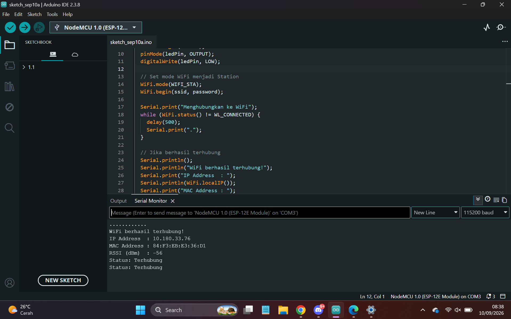

# Modul 2 – Konfigurasi Jaringan (Mode Station & Access Point) pada ESP8266

**Nama:** Muhammad Nabil Zaedan Agesy
**NIM:** H1H024062
**Program Studi:** Teknik Komputer
**Mata Kuliah:** Praktikum IoT — Modul 2

---

## 📌 Deskripsi

Repository ini berisi hasil praktikum Modul 2 tentang konfigurasi jaringan WiFi pada mikrokontroler berbasis **ESP8266 (NodeMCU 1.0 ESP-12E)**, mencakup dua percobaan utama:

- **Percobaan 2A** – Konfigurasi mode **Station (STA)**, yaitu menghubungkan ESP8266 ke jaringan WiFi yang sudah ada.
- **Percobaan 2B** – Konfigurasi mode **Access Point (AP)**, yaitu menjadikan ESP8266 sebagai penyedia jaringan (hotspot) sendiri.

> Catatan: modul acuan ditulis untuk board **ESP32** (`<WiFi.h>`), sedangkan board yang dipakai pada praktikum ini adalah **ESP8266 (NodeMCU)**, sehingga library yang digunakan adalah `<ESP8266WiFi.h>`. Fungsi-fungsi seperti `WiFi.mode()`, `WiFi.begin()`, `WiFi.softAP()`, `WiFi.localIP()`, dan `WiFi.RSSI()` tetap tersedia dan berperilaku sama pada ESP8266.

---

## 🎯 Tujuan Praktikum

1. Memahami konsep dasar jaringan nirkabel (WiFi) pada perangkat IoT.
2. Memahami perbedaan mode **Station (STA)** dan **Access Point (AP)**.
3. Mengimplementasikan konfigurasi ESP8266 agar terhubung ke jaringan WiFi yang tersedia.
4. Mengimplementasikan ESP8266 sebagai Access Point mandiri yang dapat diakses perangkat lain.
5. Membaca dan menganalisis parameter jaringan seperti IP address, MAC address, dan RSSI.

---

## 🧠 Dasar Teori Singkat

| Mode | Peran ESP8266 | Kegunaan |
|---|---|---|
| **Station (STA)** | Klien yang tersambung ke router/hotspot yang sudah ada | Mengakses internet / server pada jaringan lokal |
| **Access Point (AP)** | Penyedia jaringan (hotspot) sendiri | Konfigurasi awal perangkat IoT tanpa router eksternal |
| **AP + STA** | Gabungan keduanya | Provisioning sambil tetap terhubung ke jaringan utama |

Fungsi penting pada library `ESP8266WiFi.h` / `WiFi.h`:
- `WiFi.begin(ssid, password)` — memulai koneksi ke WiFi pada mode Station.
- `WiFi.status()` — mengembalikan status koneksi saat ini (`WL_CONNECTED`, dsb).
- `WiFi.localIP()` — menampilkan alamat IP yang diperoleh pada mode Station.
- `WiFi.macAddress()` — menampilkan alamat MAC perangkat.
- `WiFi.RSSI()` — menampilkan kekuatan sinyal WiFi (dBm).
- `WiFi.softAP(ssid, password)` — mengaktifkan ESP8266 sebagai Access Point.
- `WiFi.softAPIP()` — menampilkan alamat IP dari Access Point yang dibuat.

---

## 💻 Percobaan 2A — Mode Station (STA)

Kode ini digunakan untuk menghubungkan ESP8266 ke jaringan WiFi rumah, lalu menampilkan status koneksi, IP address, MAC address, dan RSSI di Serial Monitor.

```cpp
#include <ESP8266WiFi.h>   // ganti dari WiFi.h karena board yang dipakai ESP8266

const char* ssid     = "UdinPetot";
const char* password = "Admin12345";

const int ledPin = D4;   // LED indikator status koneksi

void setup() {
  Serial.begin(115200);
  pinMode(ledPin, OUTPUT);
  digitalWrite(ledPin, LOW);

  // Set mode WiFi menjadi Station
  WiFi.mode(WIFI_STA);
  WiFi.begin(ssid, password);

  Serial.print("Menghubungkan ke WiFi");
  while (WiFi.status() != WL_CONNECTED) {
    delay(500);
    Serial.print(".");
  }

  // Jika berhasil terhubung
  Serial.println();
  Serial.println("WiFi berhasil terhubung!");
  Serial.print("IP Address  : ");
  Serial.println(WiFi.localIP());
  Serial.print("MAC Address : ");
  Serial.println(WiFi.macAddress());
  Serial.print("RSSI (dBm)  : ");
  Serial.println(WiFi.RSSI());

  digitalWrite(ledPin, HIGH);  // nyalakan LED sebagai indikator
}

void loop() {
  // Cek status koneksi setiap 5 detik
  if (WiFi.status() == WL_CONNECTED) {
    Serial.println("Status: Terhubung");
  } else {
    Serial.println("Status: Terputus");
    digitalWrite(ledPin, LOW);
  }
  delay(5000);
}
```

---

## 💻 Percobaan 2B — Mode Access Point (AP)

Kode ini menjadikan ESP8266 sebagai hotspot mandiri (Access Point) yang bisa diakses langsung oleh smartphone/laptop lain.

```cpp
#include <ESP8266WiFi.h>   // ganti dari WiFi.h karena board yang dipakai ESP8266

const char* ap_ssid     = "UdinPetot";
const char* ap_password = "Admin1234"; // minimal 8 karakter

void setup() {
  Serial.begin(115200);

  // Set mode WiFi menjadi Access Point
  WiFi.mode(WIFI_AP);
  WiFi.softAP(ap_ssid, ap_password);

  IPAddress apIP = WiFi.softAPIP();
  Serial.println("Access Point aktif!");
  Serial.print("SSID : ");
  Serial.println(ap_ssid);
  Serial.print("IP Address : ");
  Serial.println(apIP);
}

void loop() {
  // Menampilkan jumlah perangkat yang terhubung setiap 5 detik
  int jumlahClient = WiFi.softAPgetStationNum();
  Serial.print("Jumlah perangkat terhubung: ");
  Serial.println(jumlahClient);
  delay(5000);
}
```

---

## 🖼️ Hasil Pengujian (Percobaan 2A)

**1. Percobaan awal — SSID salah ketik ("UdinPetots"), koneksi gagal terus-menerus (hanya muncul titik-titik tanpa pernah terhubung):**


**2. Setelah SSID dan password diperbaiki, ESP8266 mulai berhasil terhubung (status "Terhubung" muncul berulang di loop):**


**3. Hasil akhir koneksi berhasil, lengkap dengan IP Address, MAC Address, dan RSSI:**



---

## 📊 Analisis Singkat

- Pada percobaan pertama, koneksi gagal karena **SSID yang dimasukkan salah ketik** (`UdinPetots`, seharusnya `UdinPetot`), sehingga `WiFi.status()` tidak pernah bernilai `WL_CONNECTED` dan program terus mencetak tanda titik (`.`) di dalam loop `while`.
- Setelah SSID dan password diperbaiki agar sesuai dengan jaringan WiFi yang sebenarnya, ESP8266 berhasil terhubung, ditandai dengan pesan `WiFi berhasil terhubung!` beserta IP Address (`10.180.33.76`), MAC Address (`84:F3:EB:E3:36:D1`), dan RSSI (`-56 dBm`).
- Nilai RSSI sekitar -56 dBm menunjukkan kekuatan sinyal yang tergolong **baik**, sehingga koneksi cenderung stabil.
- LED indikator pada pin **D4** menyala saat koneksi berhasil, dan akan mati kembali apabila koneksi terputus (dicek setiap 5 detik pada `loop()`).

---

## 📁 Struktur Repository

```
Praktikum Modul 2/
├── README.md
├── Dokumentasi/
│   ├── Ubah SSID.png
│   ├── Ubah Password.png
│   └── Terhubung.png
└── SourceCode/
    ├── modul2_konfigurasi_jaringan_sta.ino
    └── modul2_konfigurasi_jaringan_ap.ino
```

---

## 🛠️ Alat dan Bahan

- Board **NodeMCU ESP8266 (ESP-12E)**
- Kabel USB (Micro-USB)
- Laptop/PC dengan **Arduino IDE 2.3.8** (board manager ESP8266 sudah terpasang)
- Jaringan WiFi (SSID & password)
- LED + Resistor 220 Ohm (opsional, indikator koneksi di pin D4)

## ▶️ Cara Menjalankan

1. Buka Arduino IDE, pilih board **NodeMCU 1.0 (ESP-12E Module)** dan port COM yang sesuai.
2. Ganti nilai `ssid` dan `password` pada kode sesuai jaringan WiFi yang digunakan.
3. Compile dan upload program ke board.
4. Buka Serial Monitor dengan baud rate **115200** untuk mengamati proses koneksi.
